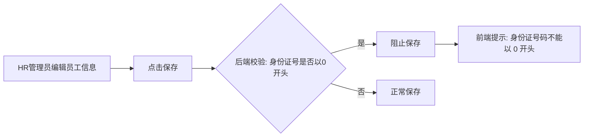

# PRD文档：身份证号校验插件

## 1. 项目概述
- 背景与痛点：HR 管理员在员工信息编辑页面修改员工信息并保存时，当前系统缺少对身份证号首位的格式校验，可能导致以 0 开头的非法身份证号被保存入库，造成脏数据。本插件将织入后端保存校验流程，拦截以 0 开头的身份证号。

## 2. 用户角色与画像
| 角色 | 描述 | 核心目标 |
| :--- | :--- | :--- |
| HR 管理员 | 负责员工信息维护与编辑，在员工信息编辑页面修改并保存员工数据 | 保存时自动校验身份证号，避免非法数据入库 |

## 3. 用户故事
- EPIC 1: 身份证号首位校验
  - US-1: 作为一名 HR 管理员，我希望在员工信息编辑页面保存时，后端自动校验身份证号是否以 0 开头，如果是以 0 开头则阻止保存并提示「身份证号码不能以 0 开头」，以便于防止非法身份证号数据入库。
    - 验收标准：
      - AC1: 员工信息编辑页面点击保存，当身份证号字段以 0 开头时，保存操作被阻止
      - AC2: 阻止保存时，前端显示提示文案「身份证号码不能以 0 开头」
      - AC3: 当身份证号不以 0 开头时，保存流程正常执行，不受插件影响

## 4. 解决方案详述与系统设计

### 4.1 方案边界与原则
- 范围：员工信息编辑页面的保存流程，身份证号首位校验
- 不覆盖范围：
  - 员工入职登记页面（本期不覆盖）
  - 身份证号其他格式校验规则（如长度、校验位、省份代码等，本期不覆盖）
- 约束：插件需织入宿主系统后端保存校验链，以 Java 实现
- 依赖：宿主系统员工信息编辑保存流程的织入点
- 待确认：是否存在需要跳过校验的特殊情况（如特殊员工类型、管理员豁免）
- 插件呈现形态：**backend**（后端 Hook，Java），织入后端保存校验流程，在保存前校验身份证号字段值

### 4.2 用户交互流程（Mermaid）

### 4.3 数据要素清单
- 实体：员工信息
- 关键字段：

| 字段名 | 类型 | 是否必填 | 用途 | 说明 |
| :--- | :--- | :--- | :--- | :--- |
| 身份证号 | String | 待确认 | 校验目标字段 | 判断是否以字符 '0' 开头 |

### 4.4 校验规则
- 校验规则 1：身份证号首位为 '0' → 校验不通过，阻止保存
- 校验规则 2：身份证号首位不为 '0' → 校验通过，保存正常执行
- 校验规则 3：身份证号为空时 → 校验通过，不阻塞保存（仅当字段有值时触发校验）

## 5. 功能需求与界面描述
### 5.1 身份证号首位校验
- 功能概述：在员工信息编辑保存流程中，后端 HOOK 校验身份证号字段，拦截以 0 开头的非法输入
- 交互细节清单：
  - 校验触发：员工信息编辑页面点击保存时，后端保存流程触发
  - 校验通过：不影响原有保存流程
  - 校验失败：阻止保存，返回提示信息「身份证号码不能以 0 开头」
  - 错误处理：前端接收到后端返回的校验失败信息后，展示提示文案
- 权限与可见性：所有触发员工信息编辑保存的 HR 管理员均受此校验
